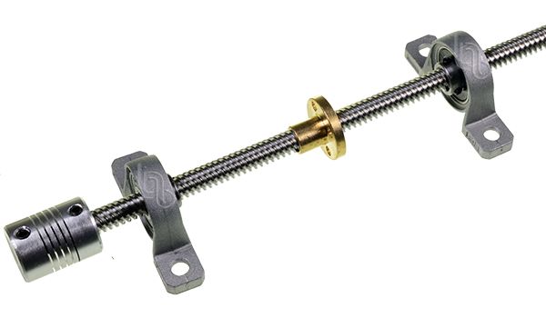
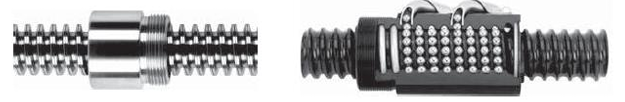
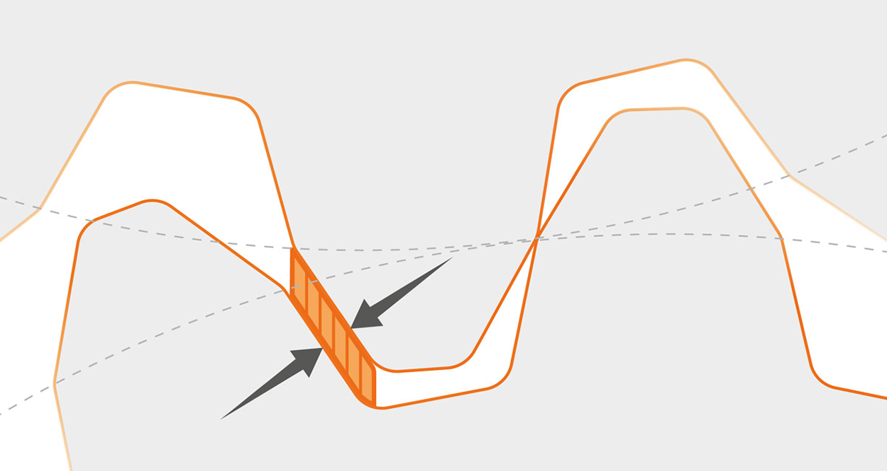
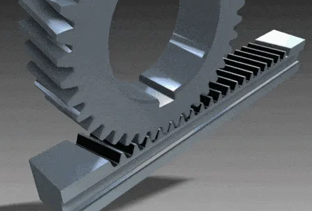
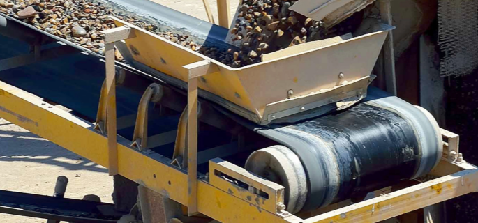
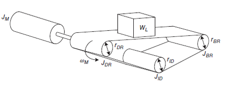

# Control de movimiento clase 24/04/2025
# 1. Introducción 
El control de movimiento es una disciplina esencial en ingeniería mecatrónica que combina principios mecánicos, eléctricos y computacionales para lograr posicionamiento preciso en sistemas automatizados, desde maquinaria industrial hasta dispositivos médicos y aeroespaciales. Su diseño requiere no solo la selección adecuada de motores, sino también la optimización de transmisiones mecánicas (como tornillos guía, piñones-cremalleras o bandas transportadoras) para adaptar velocidad, torque e inercia entre el motor y la carga, considerando factores críticos como fricción, backlash y eficiencia. El cálculo de inercias reflejadas mediante ecuaciones, es clave para evitar sobredimensionamiento o inestabilidades dinámicas, mientras que herramientas como Simscape Multibody permiten simular y validar estos sistemas, equilibrando parámetros como la relación de inercia, torque pico y ciclos de trabajo para garantizar eficiencia y confiabilidad en aplicaciones reales.  

# 2. Conceptos de Transmisión 
## 2.1. Tornillo guía
  >🔑 ¿Qué es?: Mecanismo que convierte movimiento rotacional (motor) en lineal (carga). Usado en sistemas de posicionamiento de alta precisión (CNC, impresoras 3D).

Al girar el tornillo, su rosca impulsa los dientes de la rueda dentada, provocando su rotación. A diferencia de los engranajes convencionales, en este sistema únicamente el tornillo puede mover la rueda, pero no viceversa. Esta característica lo convierte en una solución ideal para aplicaciones que requieren autobloqueo, es decir, que evitan el retroceso del movimiento de forma automática.

Figura 1. Tornillo guia con acople.

### 2.1.1 Tipos de tornillos

* ACME (Rosca): Presentan una eficiencia mecánica del 35-85%, caracterizándose por su bajo costo pero mayor fricción en comparación con otros sistemas. Existen dos configuraciones geométricas principales para sus roscas: cuadrada y trapezoidal. La versión cuadrada, aunque más económica, presenta limitaciones estructurales significativas, particularmente en los flancos de la rosca, donde los picos agudos son susceptibles a fatiga y fractura por cargas cíclicas, lo que compromete su vida útil. En contraste, el diseño trapezoidal ofrece superior resistencia mecánica al distribuir las tensiones de forma más uniforme a lo largo del perfil de la rosca, minimizando la concentración de esfuerzos. Esta ventaja estructural aunque no reduce el riesgo de fallo a futuro, garantiza un movimiento más suave y estable de la bandeja o carro, especialmente en aplicaciones con altas cargas dinámicas o ciclos de trabajo continuos.

Figura 2. Rosca cuadrada y trapezoidal.
  
* Tornillos de Esferas (Ball Screws): Eficiencias del 85-95% en tornillos de bolas (vs 35-85% en ACME), menor fricción gracias al contacto rodante, y backlash reducido que garantiza posicionamiento preciso.
  

Figura 3. Tornillo guia ACME y Ball Screw 

* El backlash, también conocido como juego mecánico u holgura, es el pequeño espacio libre entre los dientes de dos elementos engranados, como un tornillo sin fin y una rueda dentada, o entre engranajes rectos. Este fenómeno se origina por tolerancias de fabricación, la necesidad de lubricación, el desgaste natural del sistema y el diseño intencionado para evitar bloqueos por expansión térmica o sobrecargas. Aunque es inevitable en cierto grado, el backlash puede afectar negativamente la precisión de sistemas de control, CNC, robótica o servoactuadores, provocando retardo en el movimiento cuando se invierte el sentido de giro (juego en reversa), así como ruidos y vibraciones si es excesivo. Además, está relacionado con un fenómeno de torsión en la cadena cinemática, en el que, momentáneamente, no se transmite fuerza de forma efectiva debido a la discontinuidad generada por esta holgura.
  

Figura 4. Backlash.

### 2.1.2 Relación de Transmisión 
* Paso (Lead): Distancia lineal por revolución, en otras palabras, es la relación de cuanto se mueve la capsula cuando el tornillo de una vuelta
* Cabeceo (Pitch): Revoluciones por metro lineal, en otras palabras, es el número de revoluciones que debe tener el tornillo para que la capsula se desplace 1 metro.

Para entender la relación entre el desplazamiento angular del tornillo y el desplazamiento lineal de la capsula (Carriage), se tienen las siguientes ecuaciones: 

$$\Delta\theta= 2\pi(p)\Delta(x)$$  (1)

$$\frac{ \Delta^{\dot{}}\theta}{\Delta \dot{x}}= 2\pi p$$ (2)

Donde: 

$$\Delta^{\dot{}}\theta$$ Es la razón de cambio de $$\Theta$$ con respecto al tiempo y será la velocidad angular del motor en rad/s o RPM. Y $$\Delta \dot{x}$$ es la razón de cambio de $$x$$ con respecto al iempo y será la velocidad lineal de la carga en m/s.

Entonces la relación de transmisión resulta siendo: 

$$\frac{{\dot{\theta}}}{\dot{x}}= 2\pi p$$ (3)

# 📚 Ejercicio 1
Un tornillo sin fin tiene un paso (p) de 5 rev/m. Si el motor que lo impulsa gira a una velocidad angular de $$\dot{\theta}= 31.42 rad/s$$. ¿Cuál es la velocidad lineal de desplazamiento de la tuerca acoplada al tornillo?

Solución: 

$$\frac{{\dot{\theta}}}{\dot{x}}= 2\pi p \to \dot{x}= \frac{\dot{\theta}}{2\pi p}$$

$$\dot{x}=\frac{31.42}{2\pi (5)}= 1.00 m/s$$

La velocidad lineal de desplazamiento de la tuerca acoplada al tornillo será de 1 m/s. 

------------------------------- ° ------------------------------- ° ------------------------------- ° ------------------------------- ° 
### 2.1.3 Inercia Reflejada 

Ahora bien, al tener en cuenta que la carga se desplazará linealmente siempre, la energía cinética sobre ella será: 

$$KE = \frac{1}{2}m(\dot{x})^{2}$$ (4) 

A raiz de la relación de transmisión Ecuación (3) se reemplazan los valores:

$$KE = \frac{1}{2}m\frac{1}{(2\pi p)^{2}}(\dot{\theta })^{2}$$  (5) 

 Ahora, la inercia reflejada en el sistema será:

$$J_{ref}= \frac{m}{(2\pi p)^{2}}$$ (6)

O equivalente si $$N_{s}= 2\pi p$$ : 

$$J_{ref}= \frac{m}{(N_{s})^{2}}$$ (7)

### 2.1.4 Inercia reflejada total 

Los componentes clave del sistema incluyen las masas involucradas y la inercia total reflejada. La carga (Load) y el carro (Carriage) tienen pesos $$W_{L}$$ y $$W_{C}$$ respectivamente, expresados en newtons [N]. La masa total equivalente del sistema se calcula como $$m = \frac{W_{L}+W_{C}}{g}$$ donde $$g= 9.81 m/s^{2}$$ es la aceleración debida a la gravedad. Por otro lado, la inercia total reflejada del sistema, denotada como $$J_{total}$$ está compuesta por tres contribuciones principales: la inercia del tornillo, la inercia reflejada de la carga, y la inercia reflejada del carro. Estos parámetros son fundamentales para el diseño y análisis dinámico de sistemas de movimiento lineal accionados por tornillo.

$${total}= J_{tornillo}+J_{reflejada de la carga}+J_{Carro}$$ (8)

* La inercia del tornillo dependerá de la geometría y el material del tornillo. Sin embargo, las otras inercias si se pueden conocer facilmente con las siguientes formulas matemáticas:

Inercia de la carga reflejada:

$$\frac{1}{\eta (N_{s})^{2}}(\frac{W_{L}}{g})$$ (9)

Inercia del carro reflejada: 

$$\frac{1}{\eta (N_{s})^{2}}(\frac{W_{C}}{g})$$ (10)

Formula completa: 

$$J_{Tornillo}+\frac{1}{\eta (N_{s})^{2}}(\frac{W_{L}+W_{C}}{g})$$ (11) 

* Nota importante: En sistemas de alta precisión, es importante considerar también la inercia del acoplamiento entre el motor y el tornillo, ya que esta puede influir en el rendimiento dinámico. La inercia reflejada representa el efecto de la masa de la carga trasladado al eje del motor, como si ambos estuvieran directamente conectados. Este concepto es fundamental porque permite modelar todo el sistema en términos rotacionales, lo que facilita tanto el análisis dinámico como el diseño de sistemas de control. Además, el uso de tornillos con un mayor paso reduce la inercia reflejada, lo que resulta en una respuesta más ágil y eficiente del sistema.

### 2.1.4 Análisis Torque de carga

Las fuerzas externas que actuan sobre el sistema se componen de la fuerza de fricción $$F_{f}$$, la fuerza gravitacional $$F_{g}$$, y una fuerza externa adicional que puede ser el empuje u otra fuerza predominante $$F_{p}$$

$$F_{ext}=F_{f}+F_{g}+F_{p}$$ (12)

* La fuerza de fricción es :
  
  $$F_{f}= \mu (W_{L}+W_{C})cos\beta$$ (13)

* La fuerza gravitacional es:

 $$F_{g}= (W_{L}+W_{C})sin\beta$$ (14)

Si $$\beta = 0$$ es horizontal 

* Formula completa de fuerzas externas:

$$F_{ext}=F_{p}+(W_{L}+W_{C})(sin\beta +\mu cos⁡\beta )$$ (15)

El torque requerido para mover una carga, denotado como $$T_{load in}$$ puede determinarse a partir del trabajo realizado por una fuerza externa. En términos lineales, el trabajo se define como $$Work=F_{ext}* \Delta x$$ donde se encuentra la fuerza aplicada y el desplazamiento lineal Al pasar a un análisis rotacional, el trabajo se expresa como $$Work=T_{load in}* \Delta \theta$$ siendo $$\theta$$ el valor de la velocidad angular. Dado un sistema basado en tornillo, existe una relación entre el desplazamiento lineal y angular: $$\Delta x = \Delta \theta * \frac{2\pi }{p}$$  donde p es el paso del tornillo en revoluciones por metro. A partir de esta relación, se obtiene la expresión del torque reflejado hacia el actuador como: 

$$T_{load in}= \frac{F_{ext}}{\eta (N_{s})}$$ (16)

donde $$\eta$$ representa la eficiencia del sistema (típicamente entre 0.7 y 0.9) y $$N_{s}= \frac{2\pi }{p}$$ es la relación de transmisión del sistema tornillo-tuerca. Esta ecuación permite calcular el torque necesario considerando las pérdidas por fricción y la geometría del mecanismo.

 💡Ejemplo 1
 
Una carga de 50 Kg debe ser posicionado usando un tornillo esferado de acero con 0,14 Kg/cm³ de densidad, 0,182 cm de diámetro, 36 cm de longitud, 0,75 cm/rev de paso y 90% de eficiencia. El carro pesa 0,23 Kg. Calcule la inercia reflejada por la transmisión hacia su eje de entrada.

* El valor mostrado de 386 $$in/s^{2}$$ equivale a 9.804 $$m/s^{2}$$
* Para el valor de $$N_{s}$$ se usa la ecuación  $$N_{s}= \frac{2\pi }{p}$$

   $$N_{s}= \frac{2\pi }{0.75} = 8.38$$

* $$J_{screw} = ?$$
  
$$J_{screw}= \frac{\pi L p D^{4}}{32}$$

$$J_{screw}= \frac{\pi (0.36)(140000) (0.00182)^{4}}{32}=5.42x10^-8 Kg m^{2}$$
  
* $$\eta = 0.9$$
* $$W_{L} = 50kg$$
* $$W_{C}= 0.23kg$$

Inercia reflejada: 

$$J_{ref}= 5.42x10^-8 + \frac{1}{0.9*(8.38)^{2}}(\frac{50+0.23}{9.804})= ​0.081 Kgm^{2}$$

### 2.1.3 Simulink Matlab Multibody

Este ejemplo hecho por MathWorks modela un tornillo de avance con fricción. Se utiliza un modelo de un tornillo de paso 2mm y 4 hilos. Se añade los parámetros de Lead Screw Joint y una plancha para que se vea el movimiento lineal que realiza mientras el tornillo rota. 

Figura 4. 

## 2.2 Sistema Piñón - Cremallera
>🔑 ¿Qué es?: Mecanismo que convierte movimiento rotacional (piñón) en lineal (cremallera) mediante engrane directo. La cremallera casi siempre es metálica para soportar cargas pesadas y es por ello, que este tipo de transmisión es ideal para aplicaciones que requieren precisión y fuerza en ejes lineales.

Figura 5. Piñón-cremallera. 

### 2.2.1 Relación de Transmisión 
>🔑 ¿Qué es?: Define cómo la velocidad angular del piñón $$w_{pinion}$$ se traduce en velocidad lineal de la cremallera $$V_{rack}$$

$$N = \frac{w_{motor}}{v_{rack}}$$ (17)

Escrito de otra manera y solo si se están tratando velocidades en rad/segundos:

$$N_{RP}= \frac{1}{r_{pinion}}$$ (18)

$$V_{rack}= r_{pinion} * w_{pinion}$$  (19) 

Donde $$r_{pinion}$$ será el radio del piñón. 

### 2.2.2 Inercia reflejada
>🔑 ¿Qué es?: Inercia equivalente "vista" por el motor:

Cómo formula matemática sería: Inercia del Piñón + Inercia de la carga + Inercia del carro 

$$J_{ref} = J_{pinion}+\frac{1}{\eta N^{2}}(\frac{W_{L}+W_{C}}{g})$$ (20)

* η: Eficiencia (típicamente 0.8 - 0.9 para buena eficiencia en el sistema; = 1 en ideal).
* $$W_{C}$$ es el peso de la cremallera
* La inercia del piñón $$J_{pinion}$$ se da en unidades de $$Kg*m^2$$

### 2.2.3 Torque reflejado
>🔑 ¿Qué es?: Torque que el motor debe generar para superar todas las fuerzas externas que se oponen al movimiento del sistema.

$$T_{load\to in}=\frac{F_{ext}}{\eta N_{RP}}$$  (21)

* Donde $$F_{ext}$$ es la suma de todas las fuerzas externas y $$N_{RP}$$ la relación de transmisión adimensional. Es fundamental identificar qué elementos deben reflejarse en una ecuación de este porte, y estos corresponden a lo que se encuentra al otro lado de la transformación de energía.

* Entre las observaciones más importantes de este sistema, cabe recalcar que a nivel estructural, requiere una correcta lubricación y mantenimiento para evitar desgaste prematuro por contacto constante, y una buena alineación para resistir adecuadamente las cargas radiales y axiales.

#  📚 Ejercicio 2

DATOS: 
$$W_{L} = 300 N = W_{C}$$
$$\mu = 0.2$$
$$\beta = 45°$$
$$\eta = 0.85$$
$$N_{RP}=60$$ 
$$F_{g}= 120.89$$ N

$$F_{f}= 0.2 * 600 *cos(45°)= 63.038 N$$
$$f_{ext}= 63.038+120.89= 183.928 N$$

Teniendo en cuenta la ecuación (21) :

$$T_{load\to in}=\frac{183.928}{(0.85)(60)}= 3.606 N * m$$

------------------------------- ° ------------------------------- ° ------------------------------- ° ------------------------------- ° 
## 2.3 Banda transportadora 
>🔑 ¿Qué es?: Sistema que transmite movimiento mediante poleas y una banda continua, usado en transporte de materiales, líneas de ensamblaje o producción, clasificación y distribucion de productos. 

### 2.3.1 Relación de transmisión (Poleas iguales) 

Figura 6. Banda transportadora de poleas iguales.

$$N_{BD}= \frac{1}{R_{IP}}; V_{belt}= r_{IP}* w_{IP}$$ (22)

$$r_{IP}$$ Es el radio de la polea de entrada, es decir, la que es motriz. 

### 2.3.2 Inercia reflejada
Considera inercias de poleas (2 poleas existentes en el sistema), de la banda, la carga y el carro.

$$J_{ref} = \color{Red} 2J_{p}\color{Yellow} +\frac{1}{\eta N^{2}}(\frac{W_{L}+W_{C}+W_{Belt}}{g})$$ (23)

* La inercia en las dos poleas se toman como si fueran valores iguales y este valor NO se refleja. La parte amarilla se refleja totalmente. 

### 2.3.3 Torque de carga 
Se presenta igual que con el tornillo guia y el sistema piñón-cremallera 

$$T_{load\to in}=\frac{F_{ext}}{\eta N_{BD}}$$ (24)

* La fuerza externa total es igual a la que se emplea en el tornillo guia y el piñón -cremallera.

#  📚 Ejercicio 3

La inercia reflejada en la carga de un sistema de banda transportadora de alimentos, se tiene 8.34 N*m, con 98% de eficiencia y $$N_{BD}= 10$$. Cual es el valor de las fuerzas externas del sistema? 

Solución: 

$$F_{ext}= 8.34(0.98)(10)= 81.732 N$$

------------------------------- ° ------------------------------- ° ------------------------------- ° ------------------------------- ° 

### 2.3.4 Sistema con 3 poleas (Más complejo) 

Figura 7. Banda transportadora con 3 poleas. 

Cuando se añade una tercera polea (como en un sistema con poleas de tensión), se incrementa la cantidad de elementos rotacionales que aportan inercia reflejada al motor. El modelo se vuelve más complejo y se requiere evaluar todas las inercia rotacionales reflejadas:

$$J_{ref} =J_{DR} +J_{load-in}+J_{belt-in}+J_{ID-in} +J_{BR-in}$$   (25)

* $$J_{DR}$$ es la inercia del tambor conductor.
* $$J_{ID-in}$$ Inercia de polea intermedia.
* $$J_{BR-in}$$ Inercia reflejada de la polea de retorno.
* La inercia de la banda considera su masa distribuida.
* La inercia de la carga reflejada es igual que en un sistema de dos poleas.

  foto

### 2.3.5 Diferencias de sistemas 

En un sistema de banda transportadora con dos poleas, la complejidad mecánica es relativamente baja, lo que permite aplicar directamente la ecuación del torque requerido al motor considerando únicamente el peso de la carga, la banda, el ángulo de inclinación y la fricción. En este caso, solo intervienen el tambor motriz y la carga, por lo que la inercia total reflejada es menor. Por el contrario, en un sistema con tres poleas donde se incluyen una polea intermedia y una polea de retorno; La complejidad del sistema aumenta significativamente. Esto se traduce en un modelo más detallado que requiere considerar múltiples inercias reflejadas, incluyendo la de la banda y cada polea adicional. Como resultado, la inercia total reflejada al motor es mayor, y se debe tener en cuenta la eficiencia del sistema y las relaciones de transmisión de cada componente para obtener un cálculo preciso del torque requerido.

# 3. Conclusiones 
La transmisión en un tornillo sin fin, determinada por el número de hilos del tornillo y los dientes de la rueda, permite alcanzar grandes reducciones en un solo paso, siendo especialmente adecuada para sistemas de alta carga y baja velocidad; sin embargo, cuando se requiere transformar el movimiento rotacional en lineal con mayor precisión y eficiencia, mecanismos como el husillo de bolas ofrecen ventajas notables, ya que, a diferencia de la rosca directa, reducen la fricción mediante la recirculación de bolas, lo que mejora significativamente la vida útil, la precisión y la eficiencia, aunque a costa de una mayor complejidad y precio. Por otro lado, el sistema piñón-cremallera también convierte el movimiento rotativo en lineal, pero a través de una relación directa entre la velocidad angular del piñón y la velocidad lineal de la cremallera, lo cual lo hace más adecuado para trayectorias largas y repetitivas, a diferencia del tornillo, que se emplea comúnmente en recorridos más cortos y con mayor necesidad de precisión. En cuanto a los parámetros del tornillo, el paso y el cabeceo son esenciales para entender el desplazamiento por vuelta, ya que su relación inversa permite obtener movimientos lineales más o menos rápidos según se requiera, lo cual tiene implicaciones directas en la inercia reflejada al motor: un mayor paso reduce dicha inercia, mejorando la respuesta dinámica del sistema, aunque puede comprometer la precisión en aplicaciones de control fino. Esta inercia reflejada es un concepto clave en el modelado de sistemas mecatrónicos, ya que permite representar todos los elementos en un único dominio, rotacional o lineal, lo cual simplifica el análisis y el diseño de controladores. Finalmente, en mecanismos como bandas transportadoras con múltiples rodillos, aunque la velocidad lineal de la banda permanece constante, las velocidades angulares de los rodillos varían según sus radios, lo que, al igual que en los demás sistemas mencionados, exige una cuidadosa sincronización para garantizar un funcionamiento armónico y eficiente.

# 4. Referencias 
